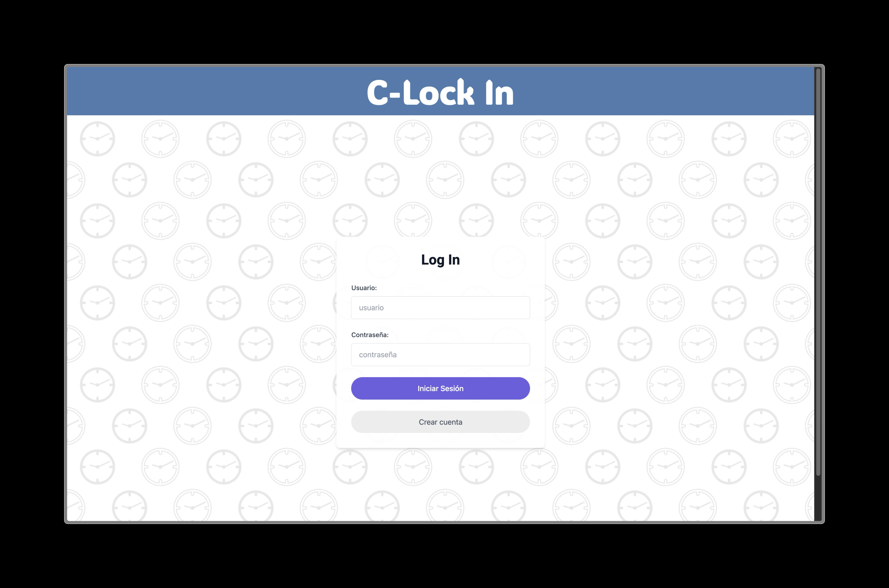
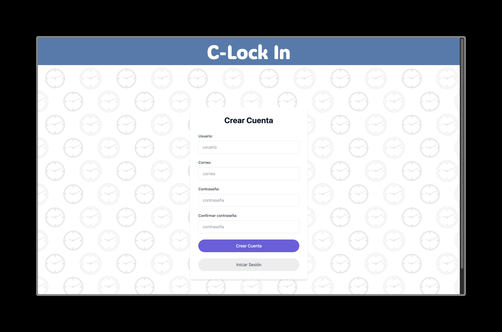
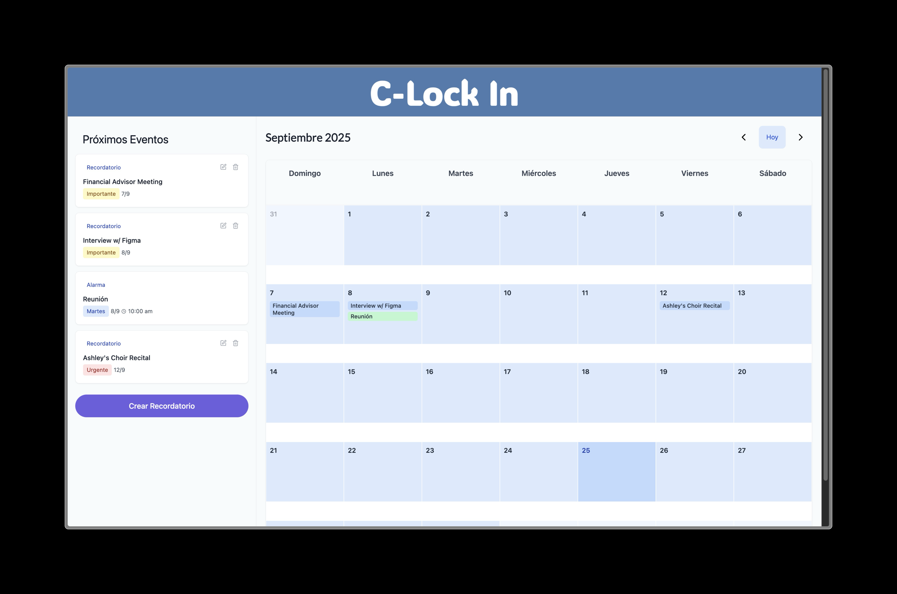
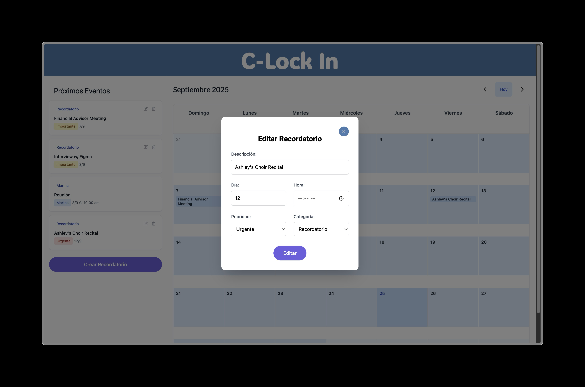
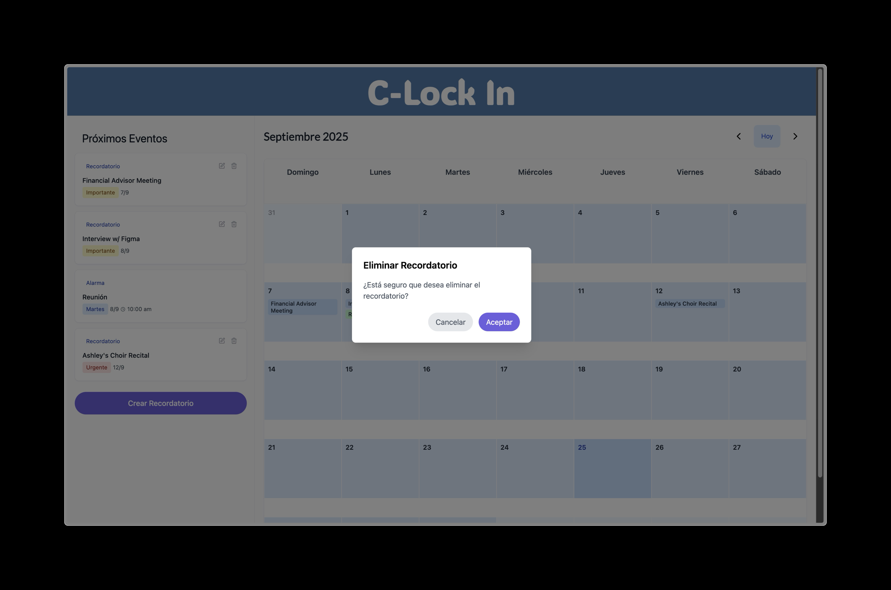

## Marilyn Stephany Joven Fonseca
202021346

### Funcionalidades
* Login
* Vista de calendario con próximos eventos
* Crear, editar, eliminar alarma

### Para ejecutar
Comandos ejecución app en React
``` shell
cd front
npm install
npm run dev
```

## Vistas:





